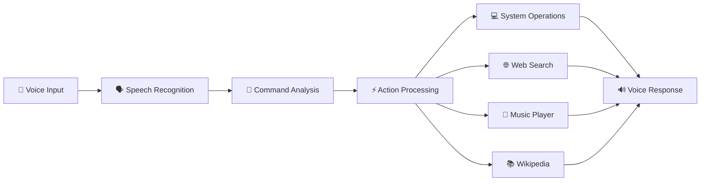

# <div align="center">


</div>

---

<div align="center">


</div>

---

# 🚀 About The Project

### 🎙️ Jarvis AI Voice Assistant

A powerful and intelligent **Voice-Controlled Desktop Assistant** built using **Python** that listens to your voice commands and performs real-world tasks instantly.

✨ Open applications

✨ Search the web

✨ Play music

✨ Answer questions

✨ Perform calculations

✨ Control your computer

✨ Act as your personal AI assistant

---

## 🎬 Live Working Flow



---

# ✨ Key Features

<table>
<tr>

<td width="50%">

### 🎤 Voice Recognition

Convert speech into commands using advanced speech recognition.

</td>

<td width="50%">

### 🔊 Voice Responses

Natural text-to-speech interaction.

</td>

</tr>

<tr>

<td>

### 🌐 Smart Web Assistant

Search Google, YouTube, GitHub and more.

</td>

<td>

### 📚 Knowledge Engine

Get instant answers from Wikipedia.

</td>

</tr>

<tr>

<td>

### 💻 Desktop Automation

Launch applications automatically.

</td>

<td>

### 🧮 Calculator Assistant

Perform mathematical operations instantly.

</td>

</tr>

</table>

---

# 🎯 Feature Progress

```text
Voice Recognition      ████████████████████ 100%

Text To Speech         ████████████████████ 100%

Web Automation         ████████████████████ 100%

Wikipedia Search       ████████████████████ 100%

Music Assistant        ████████████████████ 100%

Desktop Control        ████████████████████ 100%

AI Chat Integration    ███████████░░░░░░░░ 55%
```

---

# 📸 Project Preview

<div align="center">


</div>

---

## 🏗️ System Architecture

```text
┌─────────────────────┐
│ 🎤 User Voice Input │
└──────────┬──────────┘
           │
           ▼
┌─────────────────────┐
│ Speech Recognition  │
└──────────┬──────────┘
           │
           ▼
┌─────────────────────┐
│ Command Processor   │
└──────────┬──────────┘
           │
 ┌─────────┼─────────┐
 ▼         ▼         ▼

🌐 Web    💻 Apps   🎵 Music

           │
           ▼

🔊 Voice Response
```

---

# ⚡ Why Jarvis?

✅ Beginner Friendly

✅ Real-World Project

✅ AI Powered

✅ Automation Based

✅ Resume Worthy

✅ Open Source

✅ Expandable Architecture

---

<div align="center">

### 🌟 "Talk to your computer like Iron Man talks to Jarvis"

</div>
